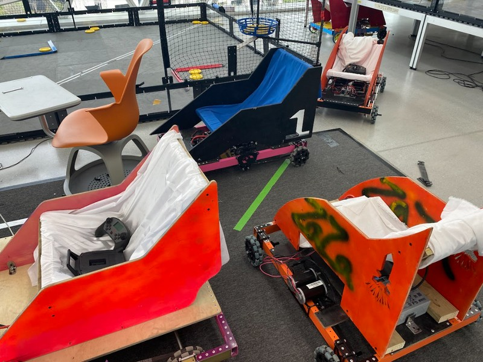
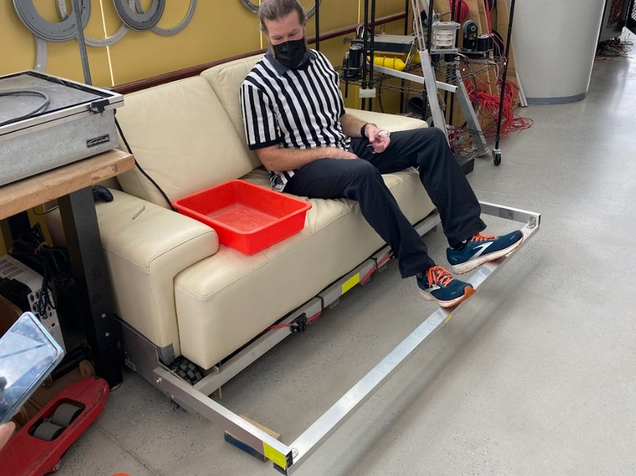
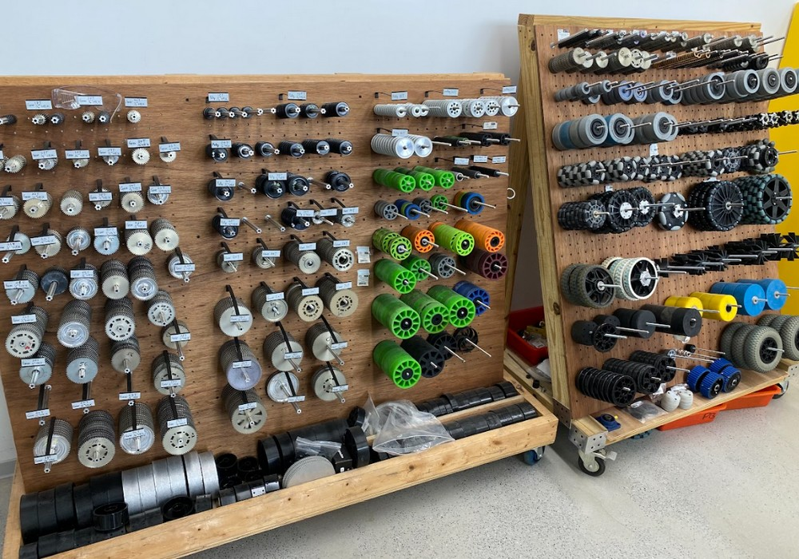
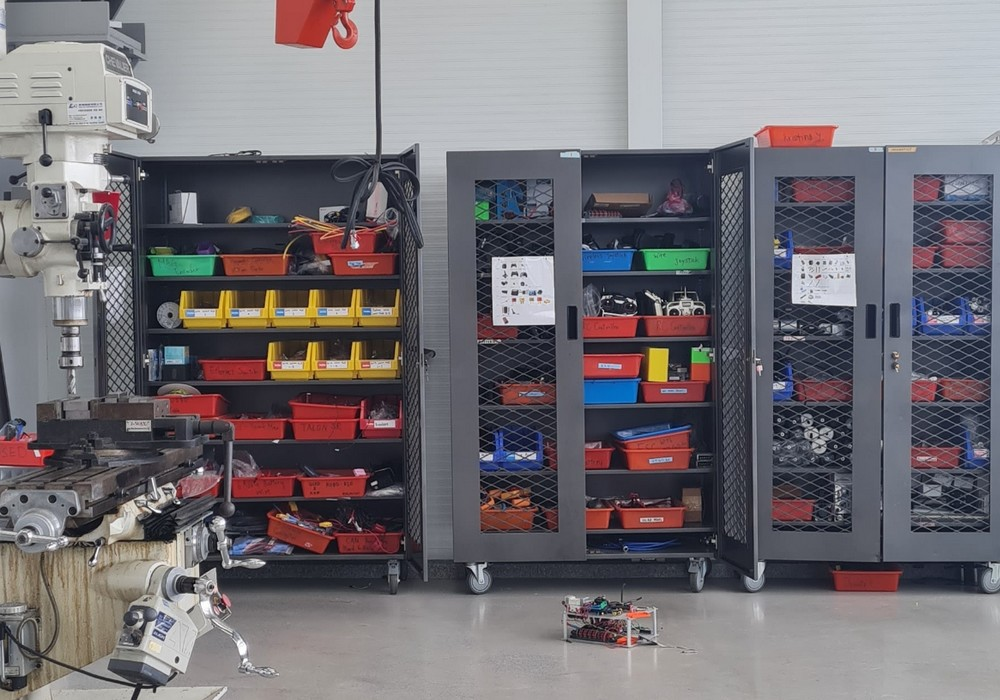
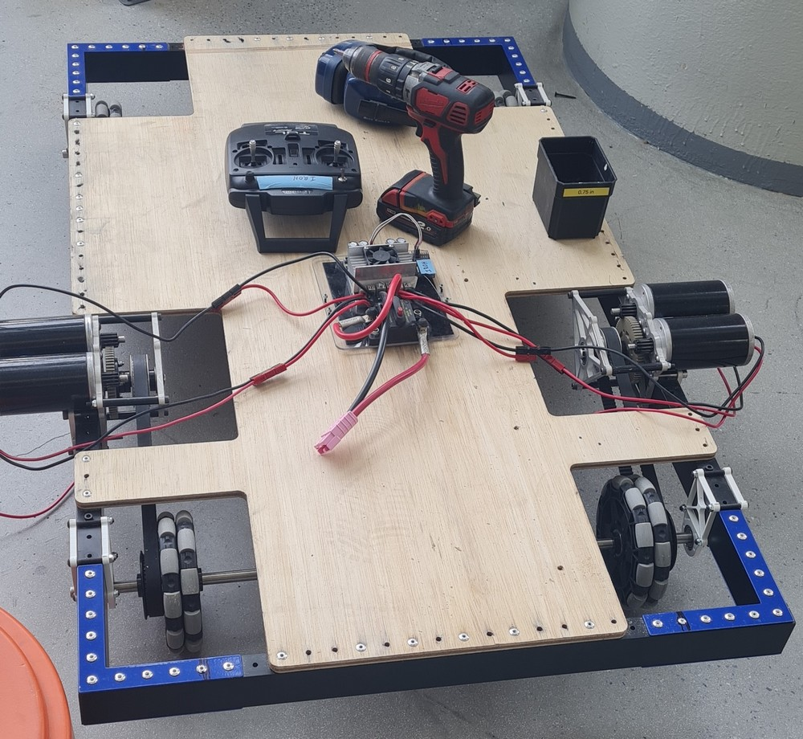

# gocart23

Electric gocart student project with FRC components. Some inspiration is taken from TAS on Formosa:

 

## 1. Mechanics

The aluminum frame of 25x50mm profiles has an outer size of 660x1220 mm (610+25+25) and is covered by a 18mm plywood plate.

The CIM motor is mounted on 5mm aluminum skeleton frames that are friction-connected to the frame with 4 M6 screws on each location. Specifics for the power train:
- CIM motor has 8mm axle and 337 Watt at 2655 rpm, mount on two #10-32 wholes on a 2" circle
- CIM mini motor has 8 mm axle and 215W at 2655 rpm

The wheels are 200mm full rubber on a 8mm steel axle with ball bearings. Front can swivel, the rear wheels are driven over gearbox and belt drive.

The CIM (217-2000)vmotor as 337W and 5330 rpm in free spin. With 20cm diameter wheels driving some 3.6km/h for safety this leads to 1 m/s and therefore 96 rpm of the wheel. The reduction ratio of 55 is achieved by a 12T/70T first stage and the Gates HTD (high torque drive) 5M-15 (5mm pitch, 15 mm wide) belt drive, see [the calculations](https://github.com/kreier/gocart23/blob/main/docs/drivetrain_gocart23.ipynb).

## 2. Control Systems

We control the two CIM motors with the TALON controlers over PWM, received from our ExpressLRS and the Radiomaster TX16S with the extension module.

## 3. Software and Programming

Using the Python interface and some LUA scripts this is going to be awesome! And safe.

## Material

We have some available, but might need more:

 

## History

#### 2022-12-02 Visit to the Tech Cube at Taipei American School

During freshmen year students of TAS use tools and materials in the 4th floor to build their own electric go-cart with remote control. The mechanical design is not completely sound, so after one semester these prototypes fall apart. But they learn CAD software, designing their model, cutting with the waterjet, wiring the control systems and testing the design. It looks like this:

#### 2022-12-23 Idea pitched

On Friday after semester 1 three students from VEX joined in the IDEA center to complete their robot for the 2022-2023 "Spin up" competition. While investigating the limits we discussed the possible reactivation of the FRC program. As a proof of concept we looked to replicate the freshmen project of TAS Taipei American School of building an electric go-cart with two CIM motors from FRC.

Observations so far:
- Aluminum frame 1220x25x50 and 610x25x50 available
- Top would be plywood, supply will be checked
- Powered by two [CIM 12V motors](https://www.vexrobotics.com/217-2000.html) with 337 W output
- Electronics with [TALON SRX](https://www.vexrobotics.com/217-8080.html?___store=vexrobotics) over PWM
- Remote control by standard PWM servo system
- Rivet gun and rivets available to create the frame
- Corner angles could be waterjet cutted (25mm wide L 150mm long)
- Some 
- 12T Steel Spur Gear 20 DP available, but further gears?
- Five [15mm HTD 5M timing belts](https://www.vexrobotics.com/htdbelts15.html) 655 are available
- Another five Gates PowerGrip HTD 600 5M15 timing belts available
- Mini CIM motor (250W) available, too
- Got two CIM motors with reduction gearbox and 20T 5M belt output for our first prototype

